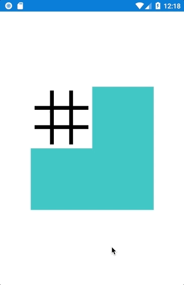

This week, in order to make the library more solid, decided to write a small
Flappy Bird alike game with it. However, it wasn’t possible: I had focused on
the scripting side but the underlying code was not powerful enough to handle
more dynamic sort of games. I had a powerful state-based way of writing games,
and just that.

So went downstairs and started rewriting from bottom up —and named Joy it
finally.

With some ideas from LÖVE 2D, Joy’s now capable of:

-   drawing images in (x, y), and

-   detect touchs within an area

; everything with a more human API (naming mostly).

This’ the playground have been using for the initial steps:

~~~~~~~~~~~~~~~~~~~~~~~~~~~~~~~~~~~~~~~~~~~~~~~~~~~~~~~~~~~~~~~~~~~~~~~~~~~~~~~~

    public class FooGame : Game
    {
        [...]

        public FooGame() : base(32, 32)
        { }

        public override void Load()
        {
            accumulatedTime = TimeSpan.Zero;
            framesPerSecond = 0;
            hue = 0;
            image = LoadImage("TicTacToe.png");
            imageX = 0;
            leftArea = new SKRect(0, 0, 16, 32);
            rightArea = new SKRect(16, 0, 32, 32);
        }

        public override void Think(TimeSpan timeSincePreviousCall)
        {
            accumulatedTime += timeSincePreviousCall;
            framesPerSecond++;
            
            if (accumulatedTime >= TimeSpan.FromSeconds(1))
            {
                System.Diagnostics.Debug.WriteLine($"{framesPerSecond} FPS");
                accumulatedTime = TimeSpan.Zero;
                framesPerSecond = 0;
            }
            
            hue = (hue + 1) % 360;

            if (DetectsTouchAt(leftArea))
            {
                imageX--;
            }
            else if (DetectsTouchAt(rightArea))
            {
                imageX++;
            }
        }

        public override void Paint()
        {
            var color = SKColor.FromHsl(hue, 50, 50);
            Erase(color);

            Paint(image, imageX, 0);
        }
~~~~~~~~~~~~~~~~~~~~~~~~~~~~~~~~~~~~~~~~~~~~~~~~~~~~~~~~~~~~~~~~~~~~~~~~~~~~~~~~

 

, producing this output:

 

I’ve been thinking the way Joy exposes touchs isn’t suitable for more complex
situations, so probably will work it out a little bit. However, I think have all
the basic pieces to finally write that Flappy Bird prototype.
